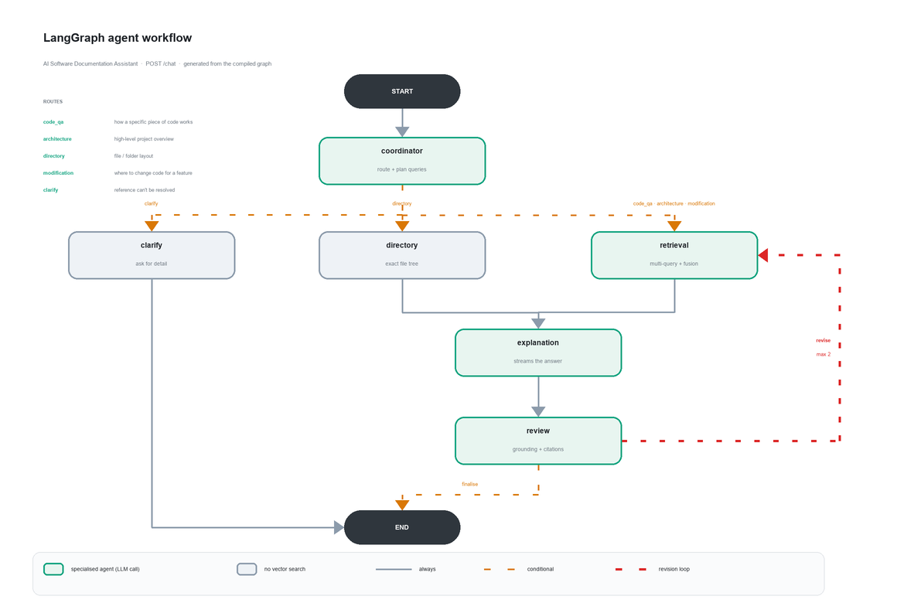

# AI Software Documentation Assistant

Ask natural-language questions about any public GitHub repository and get answers
grounded in the actual source, with citations down to the file and line range.

Paste a repo URL, wait for indexing, then ask things like *"How does authentication
work?"*, *"Where should I modify the code to add Google Login?"*, or *"Explain the
project's file directory."*

---

## Screenshots

All captured from the running app against a real indexed repository
(`psf/requests` — 94 files, 729 chunks). Nothing here is a mock-up.

**Indexing runs in the background with live progress**


**The agents report what they're doing, and sources appear before the answer**


That ordering is a contract guarantee, not a coincidence: `sources` is emitted
before any `token`, so the citation panel is populated while the answer is still
being written.

**The answer streams in, citing files inline as it goes**


**Every claim traces back to real code, with similarity scores and line ranges**


---

## Stack

| Layer | Choice |
|---|---|
| Backend | FastAPI (`backend/`) |
| Frontend | Streamlit (`frontend/`) |
| Agents | LangGraph — 4 specialised agents |
| LLM / embeddings | OpenAI |
| Vector store | ChromaDB, one collection per project |

---

## Setup

**1. Install** (Python 3.14 venv already included; versions are pinned and verified):

```bash
venv/Scripts/python.exe -m pip install -r requirements.txt
```

**2. Configure** — copy `.env.example` to `.env` and set your key:

```
OPENAI_API_KEY=sk-...          # required
GITHUB_TOKEN=                  # optional, raises GitHub's 60 req/hr limit
```

**3. Run both services** (two terminals):

```bash
# Terminal 1 — backend on :8000
venv/Scripts/python.exe -m uvicorn app.main:app --app-dir backend --port 8000

# Terminal 2 — frontend on :8501
venv/Scripts/python.exe -m streamlit run frontend/app.py
```

Open <http://localhost:8501>. Interactive API docs are at <http://localhost:8000/docs>.

Or start both at once with `.\run.ps1` (add `-Force` to reclaim the ports if a previous
run is still holding them).

### Troubleshooting: "only one usage of each socket address" (WinError 10048)

An earlier backend is still running and holding port 8000. Uvicorn logs
`Application startup complete` *before* it tries to bind, so the error appears after
what looks like a successful start — and if the old server is still answering, the app
keeps working while silently using stale code.

Find and stop it:

```powershell
# who holds the ports?
Get-NetTCPConnection -State Listen -LocalPort 8000,8501 |
  Select-Object LocalPort, OwningProcess -Unique

# stop them
Get-NetTCPConnection -State Listen -LocalPort 8000,8501 |
  Select-Object -ExpandProperty OwningProcess -Unique |
  ForEach-Object { Stop-Process -Id $_ -Force }
```

`.\run.ps1` checks this before starting and refuses to launch on an occupied port, so
the failure can't hide; plain `uvicorn` has no such guard.

---

## How it works

### Indexing

`POST /projects` downloads the repo as a zipball (no `git` binary needed), then:

1. **Scan** — walks the tree, skipping `.git`, `node_modules`, `dist`, `build`,
   `__pycache__`, `.venv`, lockfiles, minified and binary files.
2. **Chunk** — language-aware splitting, with every chunk carrying its exact
   `start_line`/`end_line`. This is what makes citations verifiable.
3. **Summarise** — generates a directory tree, repo summary, and file index, which
   are indexed alongside the code so architecture questions have something to find.
4. **Embed & store** — batched OpenAI embeddings into a per-project Chroma collection.

Runs as a background task; the UI polls `GET /projects/{id}` and shows live progress.
Nothing is written to the vector store until every embedding succeeds, so a project
is never half-indexed.

### Answering

`POST /chat` streams NDJSON from a four-agent LangGraph pipeline:



*Generated from the compiled graph by `planning/generate_graph_diagram.py`, which reads
the nodes and edges out of `build_graph(...).get_graph()` and refuses to run if the graph
gains a node the diagram doesn't know about — so the picture can't drift from the code.*

- **Coordinator** — picks one of five routes and rewrites the question into
  self-contained search queries using conversation history, so follow-ups like
  *"explain this function"* resolve to what was actually being discussed.
- **Retrieval** — runs those queries, fuses their rankings, and pulls in neighbouring
  chunks so the model sees whole functions rather than fragments.
- **Explanation** — streams the answer, citing `path:start-end` inline.
- **Review** — checks the answer is supported by the retrieved context and
  **independently verifies every cited path** against what was actually retrieved.
  If it doesn't hold up, the answer goes back for another retrieval pass.

Two design choices worth knowing:

- **The directory route skips vector search entirely.** The exact file tree is known
  at index time; routing ground truth through an approximate retriever could only
  lose information (and it's the question RAG most often hallucinates on).
- **Answers stream before review finishes.** If Review then rejects the draft, the UI
  discards it and streams the replacement — you'll see *"Refining answer…"*. The
  alternative was withholding output until review passed, which would have made
  "streaming" meaningless.

---

## Project layout

```
backend/app/
  api/          health, projects, chat endpoints
  ingestion/    github fetch, scanner, chunker, manifest, pipeline
  vectorstore/  embedder, Chroma wrapper
  agents/       coordinator, retrieval, explanation, review, graph, prompts
  services/     project registry, conversation history, repo URL parsing
frontend/
  app.py        entry point
  api_client.py the only place that talks to the backend
  components/   sidebar, chat
  theme.py      light/dark palettes
planning/       architecture, decisions (ADRs), API contract, task breakdown
data/           gitignored: chroma/, repos/, projects.json
```

## Tests

```bash
cd backend && ../venv/Scripts/python.exe -m pytest -q
```

120 tests, fully offline — no network or API calls. The network boundary
(GitHub) and the paid boundary (OpenAI) are mocked; everything between them
is exercised for real, including a test that reconstructs each chunk from its
recorded line numbers, since every citation depends on that being exact.

## Known limitations

- Public repositories only; no auth.
- Single-instance: chat history lives in memory and is lost on backend restart
  (indexed projects and vectors persist to `data/`).
- No incremental re-indexing — re-adding a repo returns the existing project;
  there is no "refresh" yet.
- No per-request token/cost accounting.
- `MAX_FILES` (default 3000) caps very large repos; the UI flags truncation.
